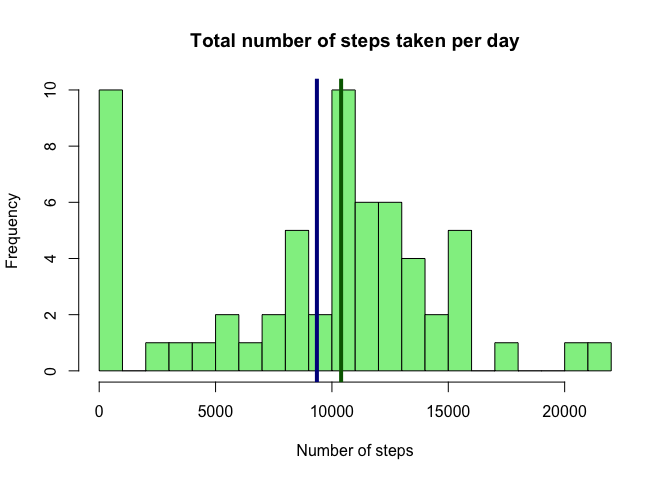
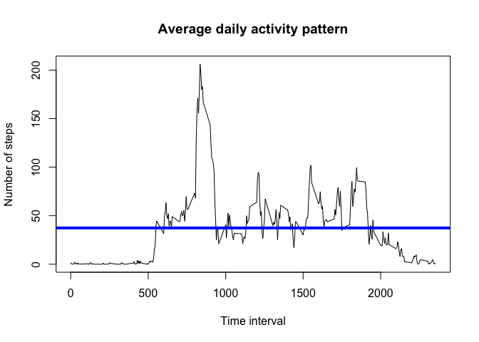
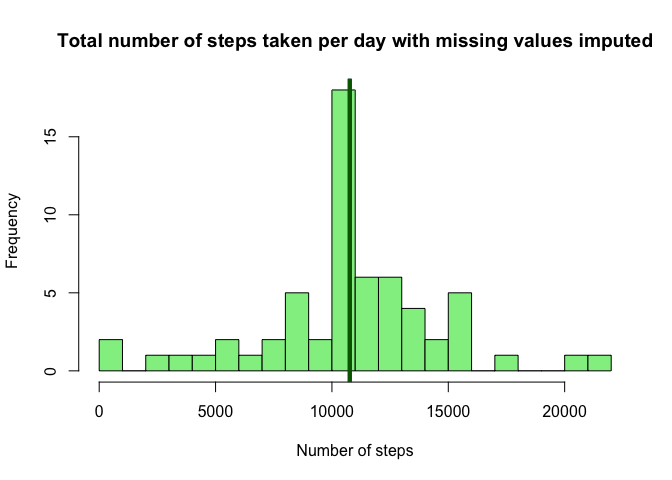
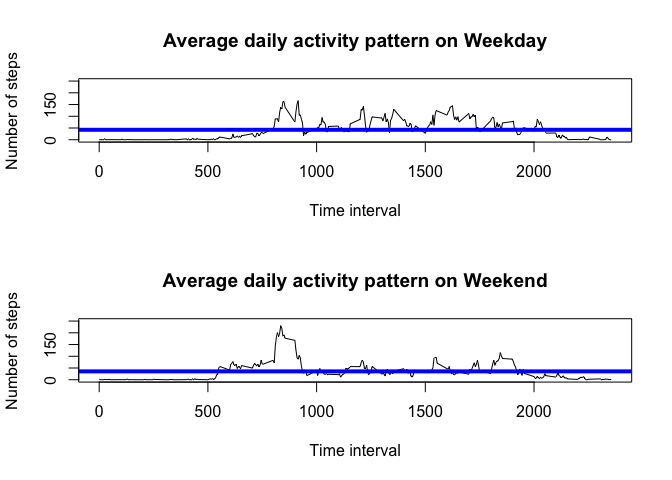

## Loading and preprocessing the data

In the first part of the study, we will load the dataset, and then process and transform the data into a format that is more suitable for analysis. 


```r
rm(list = ls())

data1 <- read.csv(file = "activity.csv")
data1$date <- as.Date(data1$date)
temp1 <- data1[, 3]
interval1 <- unique(temp1)

temp1 <- sprintf("%04d", temp1)
data1[, 3] <- format(strptime(temp1, format="%H%M"), format = "%H:%M")

date1 <- unique(data1$date)
time1 <- unique(data1$interval)

data2 <- data1[, 1]
data2 <- matrix(unlist(data2), nrow = 288, ncol = 61) 
data2 <- as.data.frame(data2)

colnames(data2) <- date1
rownames(data2) <- time1
```


## What is mean total number of steps taken per day?

In the plot below, the histogram of total number of steps taken per day is shown, with the mean value of 9354.23 shown as dark blue line, and the median value of 10395 shown as dark green line. 


```r
sum1 <- apply(data2, 2, sum, na.rm=TRUE)
mean1 <- mean(sum1)
median1 <- median(sum1)

hist(sum1, col="light green", breaks = 20, xlab = "Number of steps", ylab = "Frequency", main = "Total number of steps taken per day")
abline(v=mean1, col="dark blue", lwd = 4)
abline(v=median1, col="dark green", lwd = 4)
```

<!-- -->

```r
mean1
```

```
## [1] 9354.23
```

```r
median1
```

```
## [1] 10395
```


## What is the average daily activity pattern?

The figure below shows the average daily activity pattern, with the mean value of 37.3826 shown as blue line. The 5-minute interval of 835, on average across all the days in the dataset, contains the maximum number of steps, which equals to 206.1698. 


```r
mean2 <- apply(data2, 1, mean, na.rm=TRUE)
mean3 <- mean(mean2)

plot(interval1, mean2, type = "l",main = "Average daily activity pattern", xlab = "Time interval", ylab = "Number of steps")
abline(h=mean3, col="blue", lwd = 4)
```

<!-- -->

```r
mean2max <- max(mean2)
mean2i <- which(mean2==max(mean2))
interval1max <- interval1[mean2i]

mean3
```

```
## [1] 37.3826
```

```r
mean2max
```

```
## [1] 206.1698
```

```r
interval1max
```

```
## [1] 835
```


## Imputing missing values

The total number of missing values in the dataset is 2304. As shown in the code below, we have employed a strategy for filling in all of the missing values in the dataset, by using the mean for that 5-minute interval. In the plot below, the histogram of total number of steps taken per day with missing values imputed is shown, the mean value of 10766.19 shown as dark blue line, and the median value of 10766.19 shown as dark green line. By comprating it with the original dataset without imputing missing values, we can find that the mean value has increased noticably, while the change in median value is quite small. 


```r
na1 <- data1[(data1[ , 1] == "NA") , 1]
na2 <- length(na1)

data3 <- data2
ind3 <- which(is.na(data3), arr.ind=TRUE)
data3[ind3] <- rowMeans(data3, na.rm = TRUE)[ind3[,1]]

sum5 <- apply(data3, 2, sum, na.rm=TRUE)
mean5 <- mean(sum5)
median5 <- median(sum5)

hist(sum5, col="light green", breaks = 20, xlab = "Number of steps", ylab = "Frequency", main = "Total number of steps taken per day with missing values imputed")
abline(v=mean5, col="dark blue", lwd = 4)
abline(v=median5, col="dark green", lwd = 4)
```

<!-- -->

```r
na2
```

```
## [1] 2304
```

```r
mean5
```

```
## [1] 10766.19
```

```r
median5
```

```
## [1] 10766.19
```


## Are there differences in activity patterns between weekdays and weekends?

The plot below shows the different activity patterns between weekdays and weekends. Qualitatively, we can find that during weekdays, the activity is pretty uniform during daytime, while on weekends, the activity is more peaked in the morning. Aso we have found that the mean of averaged steps is 42.3664 on weekday and 35.61058 on weekend, the maximum of averaged steps is 166.6392 on weekday and 230.3782 on weekend, and the time invertal when the maximum of averaged steps happened is 915 on weekday and 835 on weekend. 


```r
date2 <- weekdays(date1)
date4 <- date2[] == "Saturday" | date2[] == "Sunday"
date5 <- !date4
data4 <- data3[ , date4]
data5 <- data3[ , date5]

mean4 <- apply(data4, 1, mean, na.rm=TRUE)
mean4b <- mean(mean4)

mean5 <- apply(data5, 1, mean, na.rm=TRUE)
mean5b <- mean(mean5)

par(mfrow = c(2,1))

plot(interval1, mean4, type = "l",main = "Average daily activity pattern on Weekday", xlab = "Time interval", ylab = "Number of steps",ylim=c(0,250))
abline(h=mean4b, col="blue", lwd = 4)

plot(interval1, mean5, type = "l",main = "Average daily activity pattern on Weekend", xlab = "Time interval", ylab = "Number of steps",ylim=c(0,250))
abline(h=mean5b, col="blue", lwd = 4)
```

<!-- -->

```r
mean4max <- max(mean4)
mean4i <- which(mean4==max(mean4))
interval4max <- interval1[mean4i]

mean5max <- max(mean5)
mean5i <- which(mean5==max(mean5))
interval5max <- interval1[mean5i]

mean4b
```

```
## [1] 42.3664
```

```r
mean5b
```

```
## [1] 35.61058
```

```r
mean4max
```

```
## [1] 166.6392
```

```r
mean5max
```

```
## [1] 230.3782
```

```r
interval4max
```

```
## [1] 915
```

```r
interval5max
```

```
## [1] 835
```


